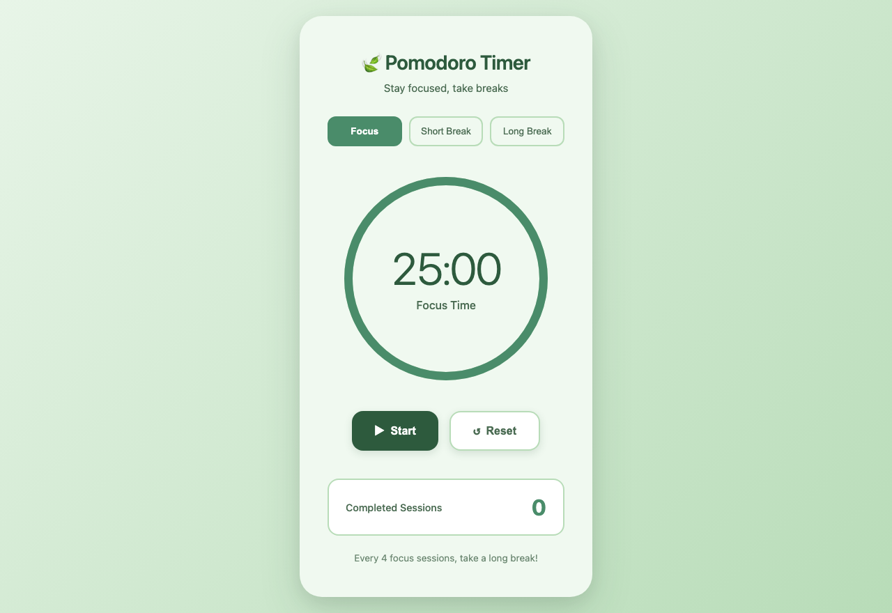

# NeevCloud Cookbook

Recipes for building AI agents you can trust with a real computer. Every recipe runs on [NeevCloud](https://neevcloud.com) sandboxes, isolated Linux machines with an MCP server, a command audit trail, network egress you control, and memory snapshots you can roll back, plus NeevCloud's own models.

Each recipe runs as written: one install, one command, and one or two API keys. For the full product documentation, see [docs.ai.neevcloud.com](https://docs.ai.neevcloud.com/).

## Prerequisites

- **A NeevCloud account** with two API keys from **Account > API Keys** in the console ([how to create one](https://docs.ai.neevcloud.com/getting-started/create-api-key)): one with Resource Type **Sandboxes** (`NEEV_API_KEY`) and one with Resource Type **Model API** (`NEEV_MODEL_API_KEY`), plus your [organization and project IDs](https://docs.ai.neevcloud.com/getting-started/org-and-project) (`NEEV_ORG_ID`, `NEEV_PROJECT_ID`).
- **Python 3.11 or later** for the Python recipes and examples.
- **Node 20.3 or later** for the TypeScript recipes and examples, from [nodejs.org](https://nodejs.org/en/download) on any system.
- **Git**, to clone the repository.

### Installing Python

Check what you have with `python3 --version` (on Windows, `py --version`). If it is older than 3.11, install Python 3.12:

- **macOS**: the installer from [python.org](https://www.python.org/downloads/macos/). The Python built into macOS is too old.
- **Linux**: Ubuntu 24.04 and later already have it; add the venv module with `sudo apt install python3.12-venv`. On Fedora, `sudo dnf install python3.12`. Older distributions that ship Python 3.11 work too: use `python3.11` wherever the commands below say `python3.12`.
- **Windows**: the installer from [python.org](https://www.python.org/downloads/windows/), or `winget install Python.Python.3.12`.

### Setting up a recipe

Each recipe installs its packages into its own virtualenv in its folder, so they never mix with your system Python. Once the virtualenv is active, `python` and `pip` are the virtualenv's own on every system.

macOS and Linux:

```bash
python3.12 -m venv .venv
source .venv/bin/activate
pip install -r requirements.txt
export NEEV_API_KEY=... NEEV_MODEL_API_KEY=... NEEV_ORG_ID=... NEEV_PROJECT_ID=...
```

Windows (PowerShell):

```powershell
py -3.12 -m venv .venv
.venv\Scripts\Activate.ps1
pip install -r requirements.txt
$env:NEEV_API_KEY = "..."; $env:NEEV_MODEL_API_KEY = "..."; $env:NEEV_ORG_ID = "..."; $env:NEEV_PROJECT_ID = "..."
```

If PowerShell refuses to run `Activate.ps1`, allow local scripts once with `Set-ExecutionPolicy -Scope CurrentUser RemoteSigned`. TypeScript recipes need no virtualenv: run `npm install` in the recipe's folder instead.

The recipe READMEs show the macOS and Linux commands. On Windows, use the PowerShell lines above for the setup and the keys, then run the recipe's own command as written.

## Quickstart

1. Create the two API keys and note the IDs listed under [Prerequisites](#prerequisites).
2. Run the flagship recipe (on Windows, swap in the PowerShell setup above):

```bash
git clone https://github.com/NeevCloudAI/neev-cookbook.git
cd neev-cookbook/recipes/prompt-to-live-app-python
python3.12 -m venv .venv
source .venv/bin/activate
pip install -r requirements.txt
export NEEV_API_KEY=... NEEV_MODEL_API_KEY=... NEEV_ORG_ID=... NEEV_PROJECT_ID=...
python app_builder.py "a pomodoro timer with a calm green theme"
```

In about a minute you get a public URL to an app an agent built inside a sandbox. Every recipe works the same way: its README lists what it needs, and it deletes everything it creates when it ends.

If `pip install` fails with `No matching distribution found for neevai`, pip is running on a Python older than 3.10, such as the one built into macOS. Set up the virtualenv with Python 3.11 or later, as above, and install again inside it.

<p align="center">
  
  <br>
  <sub>The pomodoro timer the agent built from the command above, open on its preview URL.</sub>
</p>

## Recipes

### Build things with an agent

| Recipe | What you get | Python | TypeScript |
| --- | --- | --- | --- |
| **Prompt to live app** | Describe an app; an agent builds it in a sandbox and returns a public URL | [Python](recipes/prompt-to-live-app-python) | [TypeScript](recipes/prompt-to-live-app-js) |
| **AI data analyst** | Ask a question about a CSV; an agent answers with pandas in a sandbox cut off from the internet | [Python](recipes/ai-data-analyst-python) |  |
| **Report generator** | Turn a CSV into a finished PDF and XLSX with a full Linux toolchain you never install | [Python](recipes/report-generator-python) |  |
| **Fix the failing test** | An agent fixes the code, never the tests, and hands back a patch verified in a fresh sandbox | [Python](recipes/fix-failing-test-python) |  |
| **Code mode over MCP** | One `run_python` tool against tool calls on the same question: fewer calls, fewer tokens, right answer | [Python](recipes/code-mode-mcp-python) |  |

### MCP and coding agents

| Recipe | What you get | Python | TypeScript |
| --- | --- | --- | --- |
| **Claude Code, Cursor or Codex over MCP** | Give your coding agent a disposable Linux machine with one URL, then read back what it did | [Guide and scripts](recipes/claude-code-over-mcp) |  |
| **One MCP URL, a crew of isolated agents** | A planner, a coder and a tester, each in its own sandbox, each in the audit trail | [Python](recipes/mcp-agent-crew-python) |  |
| **MCP agent with an undo button** | The agent snapshots before a risky migration, sees its tests fail and rolls itself back | [Python](recipes/mcp-agent-undo-python) |  |
| **Quarantine an untrusted MCP server** | Run a third-party MCP server with no internet and see what it tries to read, send and start | [Python](recipes/quarantine-mcp-server-python) |  |
| **Hosted coding agent** | Run OpenCode as a hosted agent on NeevCloud models, check its fix, pause and resume it | [Python](recipes/hosted-agent-python) |  |

### Audit and review

| Recipe | What you get | Python | TypeScript |
| --- | --- | --- | --- |
| **"What did my agent do?" session report** | A timeline of an agent's session from the audit trail, with sensitive reads flagged | [Python](recipes/agent-session-report-python) |  |
| **Audit evidence pack** | Every recorded operation per API key, exported to CSV and Markdown with a SHA-256 manifest | [Python](recipes/audit-evidence-pack-python) |  |
| **Human review gate** | See an agent's diff and its audit trail side by side, then approve or reject the change | [Python](recipes/human-review-gate-python) |  |

### Security and egress

| Recipe | What you get | Python | TypeScript |
| --- | --- | --- | --- |
| **Prompt-injection-proof agent** | A poisoned README tells the agent to leak `.env`; the egress allow-list stops it either way | [Python](recipes/injection-proof-agent-python) | [TypeScript](recipes/injection-proof-agent-js) |
| **Supply-chain-safe installs** | A malicious package tries to phone home during install; only the package index is reachable | [Python](recipes/supply-chain-safe-installs-python) |  |
| **Live egress approval** | The agent asks for each host it needs and a person approves it into the live allow-list | [Python](recipes/egress-approval-python) |  |
| **Run untrusted user code in your SaaS** | A small service that runs your users' code, one sandbox per user, with limits and cleanup |  | [TypeScript](recipes/untrusted-code-runner-js) |
| **Code grader** | Grade untrusted submissions in parallel, one sandbox each, with cheating and network access blocked | [Python](recipes/code-grader-python) |  |

### Snapshots, forks and rollback

| Recipe | What you get | Python | TypeScript |
| --- | --- | --- | --- |
| **Undo the agent's mistake** | An agent deletes your data; one rollback restores the files, the running server and its memory | [Python](recipes/undo-agent-mistake-python) | [TypeScript](recipes/undo-agent-mistake-js) |
| **Best-of-N with fork** | Fork a sandbox three times, race three agents on a bug, keep the first fix that passes the tests | [Python](recipes/best-of-n-fork-python) |  |
| **Skip setup with a golden snapshot** | Set up once, then start every worker from a snapshot with packages, data and a warm service | [Python](recipes/golden-snapshot-python) |  |
| **Debug at the failure point** | A job fails; fork it at that moment and let an agent find the cause in the live process | [Python](recipes/debug-at-failure-python) |  |
| **Eval rollouts from one golden snapshot** | Compare models on tasks where every rollout starts from the same golden state | [Python](recipes/eval-rollouts-python) |  |

### Long-lived sandboxes

| Recipe | What you get | Python | TypeScript |
| --- | --- | --- | --- |
| **An agent that sleeps** | Pause between bursts of work and wake with the same process and its memory | [Python](recipes/agent-that-sleeps-python) |  |
| **Coding tutor with a shared box** | A student and an AI tutor share one sandbox: SSH, a preview URL and pause between sessions | [Python](recipes/coding-tutor-python) |  |

## Integrations

Use NeevCloud sandboxes from the agent framework you already have.

| Example | What it shows |
| --- | --- |
| [hello-world-python](examples/hello-world-python) | Create a sandbox, run a command, delete it |
| [hello-world-js](examples/hello-world-js) | Create a sandbox, run a command, delete it |
| [langchain-python](examples/langchain-python) | A LangChain agent with sandbox-backed tools |
| [langgraph-python](examples/langgraph-python) | A two-agent LangGraph crew, a sandbox each, over one MCP URL |
| [crewai-python](examples/crewai-python) | Replace CrewAI's removed code execution with a sandbox tool |
| [openai-agents-sdk-python](examples/openai-agents-sdk-python) | An OpenAI Agents SDK agent with a sandbox tool |
| [vercel-ai-sdk-js](examples/vercel-ai-sdk-js) | A Vercel AI SDK agent with a sandbox tool |
| [network-egress-python](examples/network-egress-python) | An egress allow-list: one host reachable, everything else blocked |
| [playwright-python](examples/playwright-python) | A headless browser in a sandbox, with the screenshot pulled back |

## Connecting

There is no CLI to install and no bridge process to run. Any MCP client connects
with a URL and an API key:

```
https://mcp.sandboxes.as-south-1.ai.neevcloud.com/mcp
```

Send your key as a bearer token and name the sandbox you want to work in:

```
Authorization: Bearer <NEEV_API_KEY>
x-sandbox-name: my-agent
```

That single connection carries the whole surface — create a sandbox, run
commands, read and write files, start and manage processes, expose ports,
snapshot, and roll back. The sandbox name binds the connection to one machine, so
giving each agent its own name gives each agent its own isolated environment.
[MCP setup](https://docs.ai.neevcloud.com/getting-started/mcp/overview) in the docs covers the server and how to
connect [Cursor](https://docs.ai.neevcloud.com/getting-started/mcp/connect-cursor) and [Codex](https://docs.ai.neevcloud.com/getting-started/mcp/connect-codex).

The SDKs and the CLI are the other way in if you would rather call the platform
directly:

- [neev-sdk-python](https://github.com/NeevCloudAI/neev-sdk-python)
- [neev-sdk-js](https://github.com/NeevCloudAI/neev-sdk-js)
- [neev-cli](https://github.com/NeevCloudAI/neev-cli) ([docs](https://docs.ai.neevcloud.com/getting-started/neev-cli))

## Models

NeevCloud serves models too, so you do not need a second provider. The recipes use
NeevCloud's OpenAI-compatible endpoint, and the framework examples take any
OpenAI-compatible endpoint through `NEEV_MODEL_BASE_URL`:

```
https://inference.ai.neevcloud.com/v1
```

```bash
curl https://inference.ai.neevcloud.com/v1/chat/completions \
  -H "Content-Type: application/json" \
  -H "Authorization: Bearer $NEEV_MODEL_API_KEY" \
  -d '{"model": "glm-4-7", "messages": [{"role": "user", "content": "hello"}]}'
```

Use an API key with Resource Type **Model API**. A Sandboxes key is not accepted by the model endpoint. See the [Model API docs](https://docs.ai.neevcloud.com/ai-inference/overview-1) for authentication, limits and pricing.

Available models: `glm-5-2`, `glm-4-7`, `deepseek-v3-2`, `kimi-k3`, `minimax-m3`,
`minimax-m2.7`, `minimax-m2.7-highspeed`, `gpt-oss-120b`, `gpt-oss-20b`,
`llama-3.3-70b-versatile`, `llama-3.1-8b-instant`, `gemma-4-31b`.

The recipes default to `glm-4-7`, which answers tool calls quickly and reliably. Set `MODEL` to try
another (`--models` in the eval rollouts recipe, `NEEV_MODEL` in the framework examples). Reasoning models spend tokens thinking before they answer. Give them headroom —
a low `max_tokens` returns an empty message and no tool call.

## What a sandbox gives you

The [Sandbox docs](https://docs.ai.neevcloud.com/agentic-studio/overview) cover each of these in detail.

- **Root on a real machine.** Install packages, run servers, keep a filesystem.
- **A network boundary you control.** Egress denies everything by default; you
  allow the domains your agent actually needs ([Internet access and egress](https://docs.ai.neevcloud.com/agentic-studio/overview/internet-access)).
- **Pause and resume.** Pause a sandbox between bursts of work and resume it with
  its files, memory and running processes as they were.
- **Snapshot and rewind.** Capture a sandbox, fork it, or roll it back when an
  agent breaks something ([Snapshots](https://docs.ai.neevcloud.com/agentic-studio/overview/snapshots)).
- **An audit trail.** Every operation (a command, a file read or write, a process
  start) is recorded against the key that ran it, without its arguments, so the
  trail is safe to keep.

## Repository layout

```
recipes/      one folder per recipe, each self-contained with its own README and tests
examples/     framework integrations and short single-feature examples
assets/       screenshots used by the READMEs
.github/      issue and pull request templates, and the nightly check that runs every recipe
```

## Contributing

Recipes and examples are welcome. [CONTRIBUTING.md](CONTRIBUTING.md) describes what every recipe does
(cleanup on every path, bounded agents, real output only) and how to verify one before opening a pull
request. Please follow the [Code of Conduct](CODE_OF_CONDUCT.md).

## Security

Report vulnerabilities privately to **security@neevcloud.com** or through
[GitHub private vulnerability reporting](https://github.com/NeevCloudAI/neev-cookbook/security/advisories/new), not in a public issue.
See [SECURITY.md](SECURITY.md).

## License

Apache 2.0. See [LICENSE](LICENSE).
