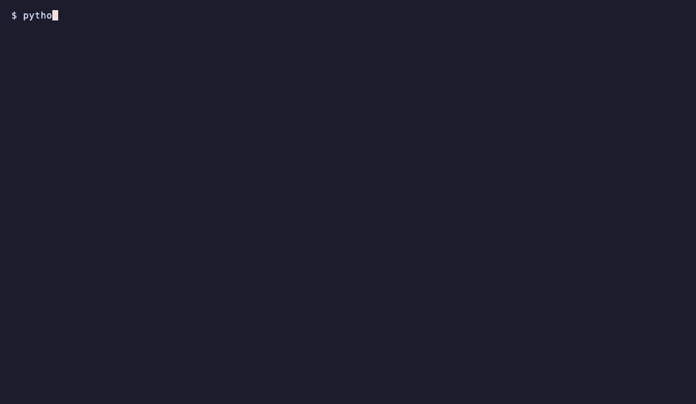
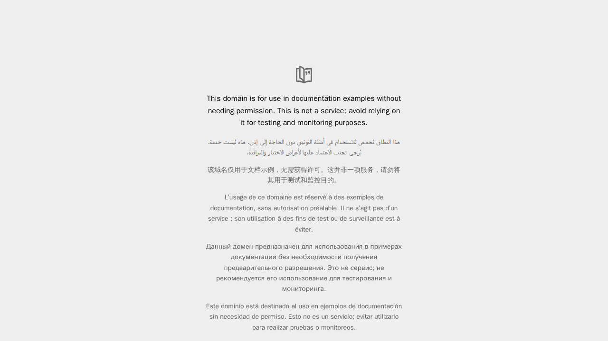

# Playwright in a sandbox

Run a real headless browser inside a sandbox, screenshot a page and pull the image back to your machine. The sandbox can reach only the hosts the install and the page need.

<p align="center">
  
</p>

You need Python 3.11+, a **Sandboxes** key ([create a key](https://docs.ai.neevcloud.com/getting-started/create-api-key)) and your [organization and project IDs](https://docs.ai.neevcloud.com/getting-started/org-and-project).

```bash
python3.12 -m venv .venv
source .venv/bin/activate
pip install -r requirements.txt

export NEEV_API_KEY=...
export NEEV_ORG_ID=...
export NEEV_PROJECT_ID=...

python browser_in_sandbox.py
```

On Windows, see the [setup guide](../../docs/setup.md#windows) for the PowerShell commands.

Output:

```
  sandbox ready: pw-dae6cc9f
  installing playwright (a few minutes on first run)
  page title: Example Domain
  saved screenshot.png (71386 bytes)
  reaching a host not on the allow-list: blocked

  sandbox deleted
```

The screenshot that run saved, taken by the browser inside the sandbox:

<p align="center">
  
</p>

The whole run took about five minutes, most of it installing the browser and its system packages.

- The sandbox is created with an egress allow-list (`ALLOWED` in the script): the Python package index, Playwright's browser download hosts, the Ubuntu package mirrors that `playwright install --with-deps` uses, and `example.com`. Drop a host and the step that needs it fails.
- Playwright's CDN redirects the Chrome download to `storage.googleapis.com` and other downloads to Microsoft's download host, so both are on the list.
- `sandbox.files.read("shot.png")` returns the screenshot's bytes, which the script saves as `screenshot.png`.
- The last check shows the allow-list is real: a host that is not on it cannot be reached.

Set `TARGET_URL` to screenshot another page, and add its host to `ALLOWED`. The script exits 1 if the install or the page load fails, and deletes the sandbox either way.
