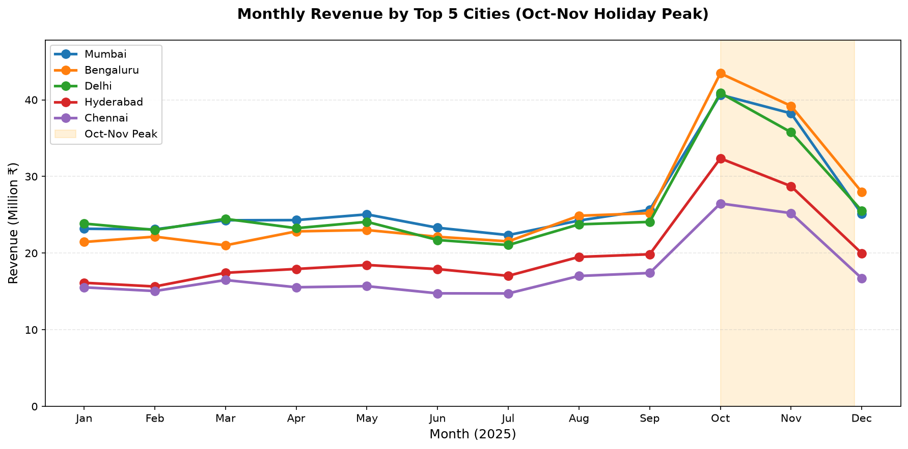

# AI data analyst

Ask a question about a CSV in plain English. An AI agent answers it by writing and running pandas code inside an isolated NeevCloud sandbox that cannot reach the internet, and hands you a chart and its findings.

<p align="center">
  
</p>

<p align="center">
  
</p>

## What you need

- Python 3.11 or later
- A NeevCloud account with two API keys from **Account > API Keys** ([how to create one](https://docs.ai.neevcloud.com/getting-started/create-api-key)):
  - one with Resource Type **Sandboxes** (`NEEV_API_KEY`)
  - one with Resource Type **Model API** (`NEEV_MODEL_API_KEY`)
- Your [organization and project IDs](https://docs.ai.neevcloud.com/getting-started/org-and-project) (`NEEV_ORG_ID`, `NEEV_PROJECT_ID`)

## Run it

```bash
python3.12 -m venv .venv
source .venv/bin/activate
pip install -r requirements.txt
export NEEV_API_KEY=... NEEV_MODEL_API_KEY=... NEEV_ORG_ID=... NEEV_PROJECT_ID=...
python analyst.py
```

On Windows, see the [setup guide](../../docs/setup.md#windows) for the PowerShell commands.

With no arguments it analyses the bundled sample, `data/sales.csv`: 384 rows of synthetic monthly sales for eight Indian cities and four product categories in 2025, with made-up festive-season and monsoon effects. The chart is saved as `chart.png` and the findings are printed.

To use your own data and question:

```bash
python analyst.py --csv tickets.csv --out tickets.png "Which support channel is slowest to resolve?"
```

## How it works

The script and the agent hold different powers. The script uses the SDK for the lifecycle and the network; the agent only gets workspace tools over MCP.

1. `client.sandboxes.create({...}, allow_egress=["pypi.org", "files.pythonhosted.org"])` starts an isolated Linux machine that can reach only the Python package index. `sandbox.exec(["python3", "-m", "pip", "install", ...])` installs `pandas` and `matplotlib`, which the default template does not include.
2. `sandbox.update({"egress": {"mode": "deny_all"}})` then removes all internet access, before your data is uploaded with `sandbox.files.upload_file(path, "data.csv")`. Code the model writes cannot open a connection to any host, so the only data that leaves the sandbox is what that code prints back to the model.
3. The agent (`agent.py`) connects to the sandbox MCP server with the `x-sandbox-name` header, so its session is bound to that one sandbox. It keeps the server's `fs_list` tool, plus two local ones: `run_python(code)`, which writes the code to `analysis.py` with the MCP `fs_write` tool and runs it with the MCP `exec` tool, and `finish(findings)`, which is accepted only once `chart.png` exists. Any other tool, such as `delete_sandbox` or a bare `exec`, is refused.
4. `sandbox.files.read("chart.png")` downloads the chart. The script checks it is a PNG before saving it and printing the findings.
5. `sandbox.delete()` runs in a `finally` block, so the sandbox is removed even if the agent fails or you press `Ctrl+C`.

The sandbox runs in NeevCloud's `as-south-1` region in Indore, India, so your CSV is stored and processed there. The model is served by NeevCloud's Model API. It never receives the file as such, only the question, the code it writes and what that code prints, which can include rows of your data. The Model API does not let you choose the region a request is served from.

The model is `glm-4-7` by default. Set `MODEL` to use a different one, for example `MODEL=glm-5-2`.

## Time and cost

Typically 75 to 95 seconds end to end with the default model: about 30 seconds to install pandas and matplotlib, then 4 to 7 agent steps. The agent gets at most 20 steps and 4 minutes. You pay for the sandbox while it runs and for the model tokens the agent uses.

## Cleanup

The sandbox and everything in it, including the uploaded CSV, are deleted when the script ends, fails or you press `Ctrl+C`. If the process is killed outright, delete any leftover `data-analyst-` sandbox from the console.
