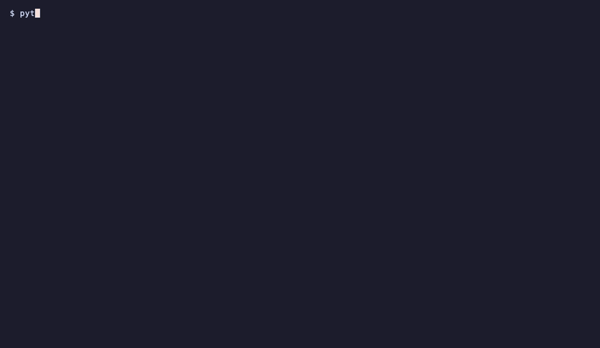

# Prompt to live app

Describe a web app in one sentence. An AI agent builds it inside an isolated NeevCloud sandbox and gives you a public URL you can open on your phone.

<p align="center">
  
</p>

<p align="center">
  
</p>

## Run it

You need Python 3.11+, a **Sandboxes** and a **Model API** key ([create a key](https://docs.ai.neevcloud.com/getting-started/create-api-key)), and your [organization and project IDs](https://docs.ai.neevcloud.com/getting-started/org-and-project).

```bash
python3.12 -m venv .venv
source .venv/bin/activate
pip install -r requirements.txt
export NEEV_API_KEY=... NEEV_MODEL_API_KEY=... NEEV_ORG_ID=... NEEV_PROJECT_ID=...
python app_builder.py "a pomodoro timer with a calm green theme"
```

On Windows, see the [setup guide](../../docs/setup.md#windows).

The app stays online for 10 minutes. Pass `--keep 0` to stop as soon as it is up, or press `Ctrl+C` to stop sooner.

## How it works

1. **Sandbox.** The script starts a sandbox with no internet access.
2. **Agent.** An agent connects to that sandbox over MCP and writes the app as static files (`index.html`, plus CSS and JavaScript). It can write, read and run commands in the sandbox, but it cannot create, pause or delete sandboxes.
3. **Serve.** The script starts a web server in the sandbox with `sandbox.processes.start(...)`.
4. **Publish.** `sandbox.get_url(3000)` gives the server a public preview URL and waits until it answers.
5. **Clean up.** When the time is up, or you press `Ctrl+C`, the sandbox is deleted and the URL stops working.

## Use it in your product

- **A "build me an app" feature:** call `run()` in `app_builder.py` with your user's request and hand them the URL it prints.
- **Your own kind of output:** change `SYSTEM_PROMPT` in `agent.py`, for example to build a landing page, a report or a data dashboard.
- **Your own stack:** the sandbox has no internet, so the agent writes plain HTML, CSS and JavaScript. To let it install packages, create the sandbox with an egress allow-list instead ([Internet access](https://docs.ai.neevcloud.com/agentic-studio/overview/internet-access)).
- **A longer-lived app:** raise `--keep`, or keep the sandbox and pause it between visits.

## Good to know

- The agent's tools come from the sandbox's MCP server, filtered to four: `fs_write`, `fs_read`, `fs_list` and `exec`. A call to any other tool is refused.
- Every tool call the agent makes is recorded in the sandbox's audit trail under your API key.
- The server listens on `0.0.0.0` so the preview URL can reach it.
- The model is `glm-4-7` by default. Set `MODEL` to try another, for example `MODEL=glm-5-2`.

## Time and cost

Usually 1 to 2 minutes from start to URL, plus the time you keep it online. The agent is limited to 25 steps and 4 minutes; if it runs out after writing `index.html`, you get what it wrote so far. You pay for the sandbox while it runs and for the model tokens. If the process is killed outright, delete any leftover `live-app-` sandbox from the console.
