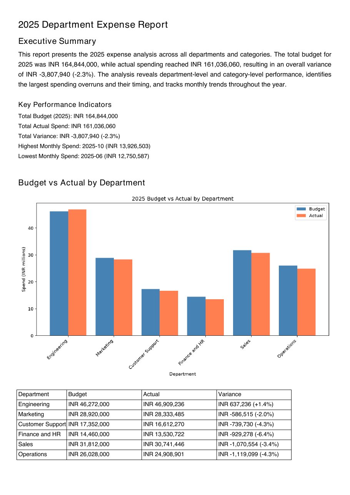

# Report generator

Turn a CSV into a finished PDF report and an Excel workbook. An AI agent writes and runs the code in an isolated NeevCloud sandbox, with pandas, matplotlib and the PDF and Excel libraries installed there for you.

<p align="center">
  
</p>

<p align="center">
  
</p>

## Run it

You need Python 3.11+, a **Sandboxes** and a **Model API** key ([create a key](https://docs.ai.neevcloud.com/getting-started/create-api-key)), and your [organization and project IDs](https://docs.ai.neevcloud.com/getting-started/org-and-project).

```bash
python3.12 -m venv .venv
source .venv/bin/activate
pip install -r requirements.txt
export NEEV_API_KEY=... NEEV_MODEL_API_KEY=... NEEV_ORG_ID=... NEEV_PROJECT_ID=...
python report.py
```

On Windows, see the [setup guide](../../docs/setup.md#windows).

With no arguments it reports on the bundled sample, `data/expenses.csv`: a year of synthetic budget and actual spend for six departments, with a few overruns to find. `report.pdf` and `report.xlsx` are saved in the current folder and the key findings are printed. To use your own data and brief:

```bash
python report.py --csv sales.csv --out-dir reports "Quarterly sales report by region and product line"
```

## How it works

1. **Install.** The script starts a sandbox that can reach only the Python package index, and installs pandas, matplotlib, openpyxl and fpdf2.
2. **Lock down.** It removes all internet access with `sandbox.update(...)`, and only then uploads your CSV.
3. **Build.** An agent connects to the sandbox over MCP. It writes one script for the workbook and one for the PDF, runs them, and fixes them until they work.
4. **Check.** The agent can only finish when both files pass the script's checks: a real PDF with at least one page and a chart, and a real workbook with at least two sheets and a formula. Otherwise it is told what is missing and keeps going.
5. **Download.** The script downloads both files with `sandbox.files.read(...)`, saves them and prints the findings. The sandbox is then deleted.

## Use it in your product

- **Scheduled reports:** run `report.py` from a cron job or a workflow with that period's CSV and a fixed brief, and send the PDF and workbook on.
- **Your own report style:** `SYSTEM_PROMPT` in `agent.py` sets the layout: the sheets, the PDF sections, units and fonts. Change it to match your house style.
- **Your own checks:** `check_pdf` and `check_xlsx` in `report.py` decide when a report counts as done. Add your own, for example a required section title or sheet name.
- **Other libraries:** add packages to `PIP_INSTALL` in `report.py`; they are installed before internet access is removed.

## Good to know

- The checks prove the files are real and have the parts asked for, not that every number is right. The agent is told to use only computed figures, but read the report as a model-written draft.
- The workbook's totals are Excel formulas, calculated when you open it in Excel, LibreOffice or Google Sheets.
- Code the model writes cannot reach the internet, and downloads are capped at 50 MB per file.
- The agent gets four tools from the sandbox's MCP server, `fs_write`, `fs_read`, `fs_list` and `exec`, plus `finish`. Any other tool is refused.
- The model is `glm-4-7` by default. Set `MODEL` to try another, for example `MODEL=minimax-m3`.

## Time and cost

Usually 2.5 to 7.5 minutes: about 50 seconds to install the packages, then the agent's work. The agent is limited to 25 steps and 7 minutes; if it runs out with both files already passing the checks, you get them without the findings. You pay for the sandbox while it runs and for the model tokens. If the process is killed outright, delete any leftover `report-gen-` sandbox from the console.
