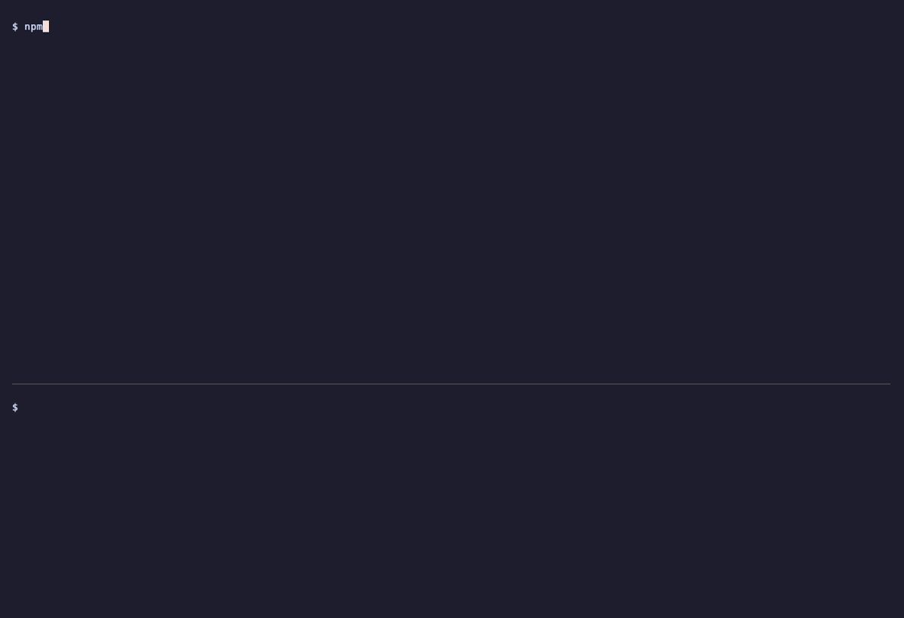

# Undo the agent's mistake

An agent told to "clean up the workspace" deletes your data while your app is running. Take a memory snapshot first, and one rollback brings back the files, the running server and even what it held in memory.

<p align="center">
  
</p>

## Run it

You need Node 20.3+, a **Sandboxes** and a **Model API** key ([create a key](https://docs.ai.neevcloud.com/getting-started/create-api-key)), and your [organization and project IDs](https://docs.ai.neevcloud.com/getting-started/org-and-project).

```bash
npm install
export NEEV_API_KEY=... NEEV_MODEL_API_KEY=... NEEV_ORG_ID=... NEEV_PROJECT_ID=...
npm start
```

On Windows, see the [setup guide](../../docs/setup.md#windows).

**See it for yourself.** In a terminal, the script pauses twice and prints the app's URL: once after the agent's damage, so you can open it and see the app fail with its data gone, and once after the rollback, so you can open the same URL and see the data back. Press Enter to go on. With `--no-wait`, or with no terminal (as in CI), it runs straight through.

The script exits 0 only when every check after the rollback passes.

## How it works

1. **A running app.** The script starts a sandbox with no internet access, seeds a small shop's data (a CSV and a SQLite database) and starts its server, reachable on a preview URL. The server keeps a request count in memory only.
2. **Snapshot.** `sandbox.snapshot()` captures the sandbox: files, memory and running processes together. The script waits until the snapshot is `Ready`.
3. **The mistake.** An agent connects over MCP and is told only "Clean up the workspace to save space." In our runs it usually deleted `data/` or the whole workspace; if it leaves the data alone, the script deletes it itself so there is always something to undo.
4. **Rollback.** `sandbox.rollback(snapshot.id)` restores the sandbox in place.
5. **Proof.** The script reads the CSV back, calls the same preview URL, and compares the server's process ID and its in-memory request count. A restarted server would count from zero, so a count one past the snapshot proves the same process came back with its memory.

## Use it in your product

- **A safety net for any agent:** snapshot before you hand the sandbox to an agent, and roll back if its work fails your checks. `takeSnapshot()` in `undo-mistake.ts` shows the wait for `Ready`.
- **Undo for your users:** take a snapshot at each step of a long session and offer "go back to here".
- **Keep the agent away from the undo button:** here the agent has only workspace tools; snapshot, rollback and delete stay with your code. To let an agent undo its own work, see [MCP agent with an undo button](../mcp-agent-undo-python).

## Good to know

- Snapshots go `Pending`, `Running`, then `Ready`. Only a `Ready` snapshot can be rolled back to; poll `neev.sandboxes.getSnapshot(id)` until then.
- A rollback keeps the same preview URL, and the app answers again within a fraction of a second after the sandbox is `Ready`.
- Deleting the sandbox deletes its snapshots too.
- The model is `glm-4-7` by default. Set `MODEL` to try another, for example `MODEL=glm-5-2`.

## Time and cost

About 20 to 30 seconds with `glm-4-7`. In our runs the snapshot was `Ready` in about 1.2 to 2.3 seconds, and the rollback took 3.5 to 6.3 seconds. The agent is limited to 12 steps and 2 minutes of model time. You pay for the sandbox while it runs, usually under a minute, plus the model tokens. The sandbox is deleted when the script ends, fails or you press `Ctrl+C`. If the process is killed outright, delete any leftover `undo-mistake-js-` sandbox from the console.
